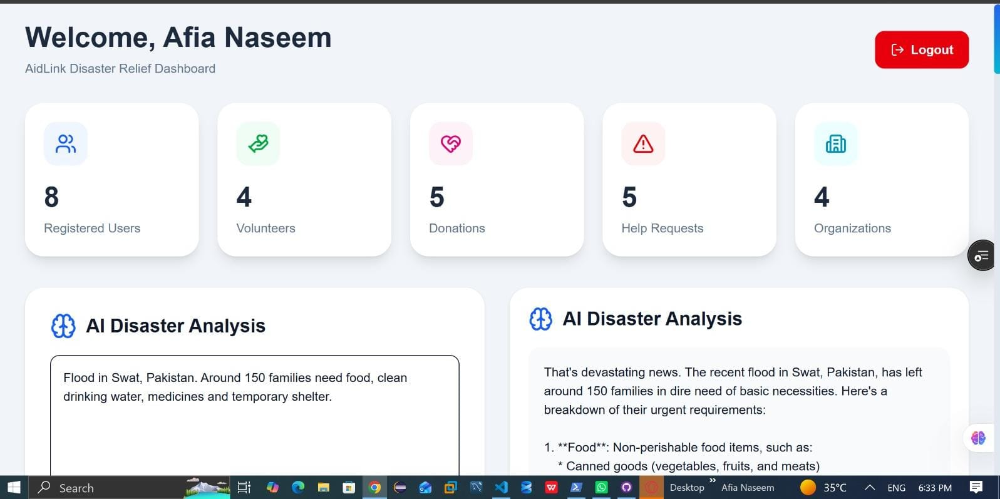

# 🌍 AidLink – AI-Powered Humanitarian Relief Platform

<div align="center">


### AidLink - An AI-Powered Disaster Relief Platform for Intelligent Coordination of Victims, Volunteers, Donors, and Relief Organizations

</div>

---
## 🚀 Live Demo

You can view the live demo of this project here:
Deployment Link


Vercel
https://aidlink-ten.vercel.app
GitHub Repository
https://github.com/afianaseemit/aidlink


# 📌 Project Overview


AidLink is an **AI-powered Disaster Relief and Humanitarian Assistance Platform** developed using **Next.js, Firebase, TypeScript, Tailwind CSS, and Groq API**.

The platform provides a centralized digital ecosystem that connects all key stakeholders involved in disaster response, enabling faster coordination, efficient resource management, and intelligent humanitarian support.

## 🌐 Connecting

❤️ **Donors** - Contribute monetary and physical donations

🙋 **Volunteers** - Register and assist during emergencies

🏢 **Relief Organizations** - Coordinate aid distribution and disaster response

🚨 **Disaster Victims** - Request emergency assistance quickly and securely

🤖 **Artificial Intelligence (Groq API)** - Analyze disaster situations and generate AI-powered response recommendations

---

## ✨ What Makes AidLink Different?


AidLink is more than a donation platform.

It combines:

- Disaster Relief
- AI Assistance
- Volunteer Management
- Organization Coordination
- Monetary Donations
- Physical Donations
- Automatic Request Assignment
- Firebase Cloud Database
- Modern Responsive UI

into a single intelligent disaster management ecosystem.
---

## 🎯 Mission

AidLink aims to make disaster response **faster, smarter, and more coordinated** by leveraging Artificial Intelligence, cloud technologies, and digital collaboration to connect communities with the help they need during emergencies.

# 🎯 Problem Statement

During disasters, affected people often struggle to:

- Find verified relief organizations
- Request help quickly
- Locate nearby volunteers
- Receive timely assistance
- Track request status

Similarly, organizations face challenges in:

- Managing requests
- Assigning volunteers
- Tracking donations
- Coordinating relief operations

AidLink solves these challenges by providing one integrated AI-powered humanitarian platform.

---

# ✨ Key Features

### 👥 User Management
- User Registration & Login
- Firebase Authentication
- Secure Session Management

### 🚨 Emergency Help Requests
- Submit disaster assistance requests
- Automatic assignment of volunteers
- Automatic assignment of suitable organizations
- Priority management using urgency levels
- Request status tracking

### ❤️ Donation Management
Supports two donation modes:

#### 💵 Monetary Donations
- Donate funds
- Select preferred organization
- Multiple payment methods
- Donation records stored securely

#### 📦 Physical Donations
- Donate food
- Clothing
- Medicines
- Shelter supplies
- Educational items
- Technology equipment
- Blood donations
- Pickup address support
- Quantity tracking

### 🤝 Volunteer Management
- Volunteer Registration
- Volunteer Dashboard
- Automatic request assignment
- Disaster response coordination

### 🏢 Organization Management
- Organization Registration
- Disaster Category Management
- Help Request Assignment
- Donation Collection

### 🤖 AI Disaster Analysis
- Groq AI integration
- Disaster impact analysis
- Resource planning assistance
- Relief recommendations
- Instructions in Emergency Situation

### 📊 Admin Dashboard
- User Statistics
- Volunteer Statistics
- Organization Statistics
- Donation Statistics
- Help Request Statistics
- Recent Activity Monitoring


## 📄 Privacy Policy

Dedicated Privacy Policy page.

---

## 📜 Terms of Service

Dedicated Terms page.

---

# 🤖 AI Features

AidLink integrates the **Groq API** to provide AI-powered disaster analysis and decision support for emergency response.

### Current AI Capabilities

✅ Analyze disaster descriptions

✅ Assess emergency situations

✅ Generate disaster response recommendations

✅ Suggest relief priorities

✅ Assist administrators with AI-generated insights

### AI Use Cases

- Disaster Situation Analysis
- Emergency Response Planning
- Humanitarian Assistance Recommendations
- Relief Resource Prioritization
- AI-powered Decision Support

---

# 🛠 Technology Stack

| Technology | Purpose |
|------------|---------|
| Next.js 16 | Frontend Framework |
| React | UI |
| TypeScript | Type Safety |
| Tailwind CSS | Styling |
| Firebase Authentication | Login System |
| Cloud Firestore | Database |
| Firebase Hosting Ready | Deployment |
| Lucide Icons | Icons |

---

# 📂 Project Structure

```
app/
components/
lib/
public/

Firebase
 ├── users
 ├── volunteers
 ├── organizations
 ├── donations
 └── helpRequests
```

---

# 🔥 Firestore Collections

## users

Stores

- Name
- Email
- Role

---

## volunteers

Stores

- Name
- Email
- City
- Status
- Skills

---

## organizations

Stores

- Organization Name
- Category
- Contact

---

## donations

Stores

- Donor Details
- Category
- Organization Selected
- Items to donate
- Pickup Address
- Amount if Monetary Selected

---

## helpRequests

Stores

- Victim Information
- Disaster Type
- Assigned Volunteer
- Assigned Organization
- Status

---

# 🔒 Security

AidLink uses Firebase Security Rules.

Features include:

- Authenticated user access
- Protected database
- Firestore security
- Firebase Authentication

Sensitive credentials are stored using:

```
.env.local
```

and are **never committed** to GitHub.

---

# 🚀 Installation

Clone repository

```bash
git clone https://github.com/YOUR_USERNAME/aidlink.git
```

Install packages

```bash
npm install
```

Run development server

```bash
npm run dev
```

---

# 🔑 Environment Variables

Create

```
.env.local
```

Example

```env
NEXT_PUBLIC_FIREBASE_API_KEY=YOUR_KEY

NEXT_PUBLIC_FIREBASE_AUTH_DOMAIN=YOUR_DOMAIN

NEXT_PUBLIC_FIREBASE_PROJECT_ID=YOUR_PROJECT

NEXT_PUBLIC_FIREBASE_STORAGE_BUCKET=YOUR_BUCKET

NEXT_PUBLIC_FIREBASE_MESSAGING_SENDER_ID=YOUR_SENDER

NEXT_PUBLIC_FIREBASE_APP_ID=YOUR_APP_ID
```

---

# 📷 Screenshots





---

# 🌐 Deployment

Project can be deployed using

- Vercel
- Firebase Hosting


## ⚠ Disclaimer

AidLink is a project developed for educational purposes.

Any payment methods, organizations, bank accounts, phone numbers, and other demonstration data included in this project are fictional placeholders unless explicitly integrated with verified services.

Future production deployments can integrate verified humanitarian organizations and official payment gateways.

# 📈 Future Improvements

AidLink is designed to grow into a real humanitarian platform.

Future enhancements include:

## 🌍 Future versions of AidLink may integrate verified humanitarian organizations such as:

- Edhi Foundation
- Pakistan Red Crescent Society
- Alkhidmat Foundation Pakistan
- Saylani Welfare International Trust
- Akhuwat Foundation
- Rescue 1122

Potential future features include:

- Real Payment Gateway Integration
- Easypaisa Merchant API
- JazzCash Merchant API
- Stripe Integration
- Bank Payment Gateway
- QR Code Payments
- Live Donation Tracking
- Donation Receipts
- Volunteer GPS Tracking
- Real-time Notifications
- SMS Alerts
- AI Matching of Donors and Victims
- NGO Verification System
- Disaster Heat Maps
- Government API Integration
---

## 💳 Real Payment Gateway

Future versions can support secure online donations through trusted payment providers such as:

- Stripe
- PayPal
- JazzCash
- EasyPaisa
- Bank Transfers

This would enable verified financial donations directly to registered humanitarian organizations.

---

## 📍 Live Location Tracking

- Google Maps Integration
- Live Disaster Mapping
- Volunteer GPS Tracking
- Nearby Shelter Discovery

---

## 📱 Mobile Application

Develop Android and iOS applications using React Native or Flutter for wider accessibility.

---

## 🤖 Advanced AI

Future AI capabilities may include:

- AI-based request prioritization
- Disaster severity prediction
- Volunteer recommendation engine
- Resource demand forecasting
- AI chatbot for emergency assistance
- Image-based disaster damage assessment

---

## 📢 Notifications

Support real-time notifications through:

- Email
- SMS
- WhatsApp
- Push Notifications
- Firebase Cloud Messaging (FCM)

---

## 📊 Analytics Dashboard

Provide organizations with advanced insights:

- Donation trends
- Volunteer activity
- Disaster response statistics
- Geographic heat maps
- Performance reports

---

## 🔄 Real-Time Collaboration

Enable:

- Live request tracking
- Multi-organization coordination
- Volunteer status updates
- Instant data synchronization

---

# 🎓 Academic Purpose

This project was developed as a part of  ACT AI Course By AI SkillBridge in partnership with HEC,PMYP,NAVTTC to demonstrate practical skills in:

- Full Stack Web Development
- Firebase Integration
- AI-Assisted Automation
- Database Design
- Responsive UI Development
- Modern Software Engineering Practices

---

# 👩‍💻 Developed By

**Afia Naseem**

BS Information Technology

International Islamic University Islamabad

GitHub:
https://github.com/afianaseemit

LinkedIn:

https://www.linkedin.com/in/afia-naseem-85815a328/
---

# 📜 License

This project is developed for educational purposes.

Future commercial use may require additional licensing and integration with official humanitarian organizations.

---

<div align="center">

### ❤️ AidLink

Connecting Humanity Through Technology

</div>